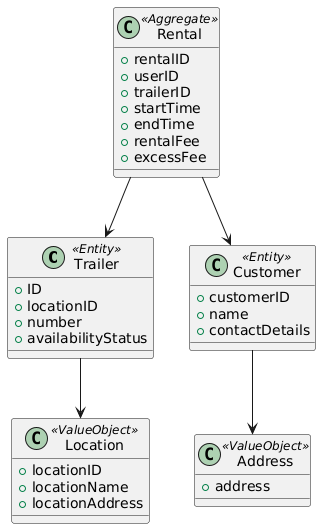

# Trailer Rental System
**Group D**

---

## Technology Stack

**Version Control Platform**:  
- Git - GitHub

**Text Editing and Development Environment**:  
- VScode/Neovim  
- DBeaver  
- Postman

**General Online Research Tools**:  
- Stack Overflow  
- MDN Web Docs  
- Golang Docs

### Development Stack

**Backend Development**:  
- Golang - (Fiber Framework)

**Frontend Development**:  
- TypeScript - (React Framework)

**Database Management**:  
- PostgreSQL

**Development Tools**:  
- Docker  
- Docker Compose

**CI/CD Pipeline**:  
- GitHub Actions

---

## Strategic Design

**Core Domain**:  
The core of MyTrailer is the trailer rental process, including booking, insurance, and payments.

**Subdomains**:
- **Rental Management**: Handles trailer reservations, bookings, returns, and excess fees for late returns.
- **Payment and Insurance**: Manages payments for insurance and partnerships with companies for trailer placements.
- **Location Management**: Tracks trailer locations across different companies (e.g., Jem og Fix, Fog).
- **Company Partnerships**: Manages agreements with the companies offering trailer parking space.

### Bounded Context Diagram
This diagram shows the different bounded contexts and their relationships.

---

## Tactical Design with DDD

**Entities, Value Objects, and Aggregates**:

- **Aggregate: Rental**
  - Properties: `startTime`, `endTime`, `rentalFee`, `excessFee`

- **Entity: Trailer**
  - Properties: `number`, `availabilityStatus`

- **Entity: Customer**
  - Properties: `name`

- **Value Object: ContactDetails**
  - Properties: `email`, `phoneNumber`, `address`

- **Value Object: Location**
  - Properties: `locationName`, `locationAddress`

---

## Event-Driven Architecture (Messaging Flow)

Since the system has several independent components (rental, payment, partnerships), using an event-driven architecture could help:

**Events**:
- `TrailerBooked`: Triggers when a user books a trailer.
- `TrailerReturned`: Triggers when a trailer is returned. It updates availability and calculates any excess fees.
- `PaymentProcessed`: Triggers after rental completion, charging the customer (for insurance or excess fees).
- `PartnershipPaymentTriggered`: Occurs when a partnership agreement triggers a payment between MyTrailer and store partners.

---

## C4 Diagrams

We chose the **Context** and **Component** diagrams because they provide the right balance of abstraction for this project. The Context diagram helps us visualize how the system interacts with external actors, while the Component diagram shows the internal structure of key services. This allows us to focus on system design without getting too detailed or technical, making it suitable for this small project within the given timeframe.

- **Context Diagram**: Illustrates how the MyTrailer system interacts with external entities like the app, payment gateways, and store partners.

---

- **Component Diagram**: Shows the internal services of the system, such as `RentalService`, `PaymentService`, `PartnershipService`, etc.

---

## Behavior-Driven Development (BDD)
Example of BDD usage in this project:

**Scenario: Customer books a trailer**  
- **Given** a customer is logged into the MyTrailer app  
- **When** they select a location and book a trailer  
- **Then** the system confirms the booking  
- **And** updates the availability of the trailer

---

## Ubiquitous Language

- **Trailer**: The rental item placed at partner locations.
- **Rental**: A short-term or long-term booking of a trailer.
- **Excess Fee**: The penalty for late returns.
- **Insurance**: An optional fee for protection against damage.
- **Location**: The specific place where a trailer is parked.

---

## Definition of DONE

- **Model Completeness**: When the core entities (`Trailer`, `Rental`, `Customer`, `Location`) and their behaviors are fully modeled.
- **Messaging Flow**: When event-driven messages (`TrailerBooked`, `PaymentProcessed`, etc.) are identified and mapped between services.
- **Architecture Documentation**: When all the diagrams (C4, component, sequence) are completed.
- **Testing Ready**: The system is ready to start experimenting with BDD scenarios and the flow of events between services.

---

